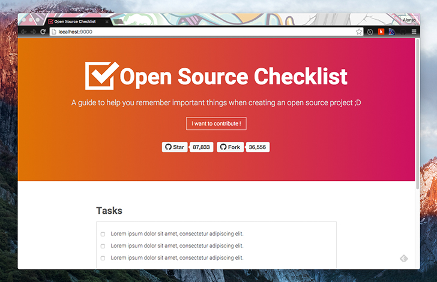

# [Open Source Checklist](http://afonsopacifer.github.io/open-source-checklist/)

> A guide for help you to create a open source project.



## Insert a new content
1 - Install the [nodejs](https://nodejs.org/en/).

2 - Install the grunt-cli
```sh
$ npm install -g grunt-cli
```

3 - Fork it!

4 - Clone

5 - Install all dependencies.
```sh
$ npm install
```
6 - Edit the **checklist.json** file and add the new content.

7 - Run the grunt task for build the static pages:

`$ grunt build`

8 - Create your feature branch:
```sh
$ git checkout -b my-new-tasks
```
9 - Commit your changes:
```sh
$ git commit -a -m 'Add some task'
```
10 - Push to the branch:
```sh
$ git push origin my-new-task
```
11 - Submit a pull request :)

## Tasks list

- Compile, concat and minify all files: `$ grunt build`
- Watch the files to build and start a static server: `$ grunt serve`
- Autoprefixer the css: `$ grunt autoprefixer`
- Deploy for gh-pages: `$ grunt deploy`

## Contributing with new features

Want to contribute? [Follow these recommendations](https://github.com/afonsopacifer/open-source-checklist/blob/master/CONTRIBUTING.md).

## Licence

[MIT Licence](https://github.com/afonsopacifer/open-source-checklist/blob/master/LICENCE.md) © [Afonso Pacifer](http://afonsopacifer.com/)
